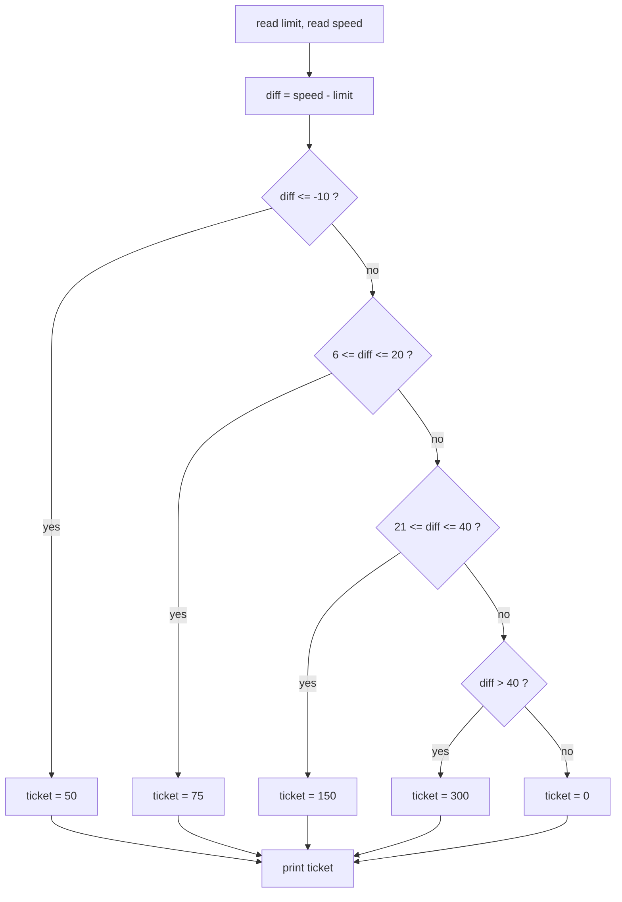
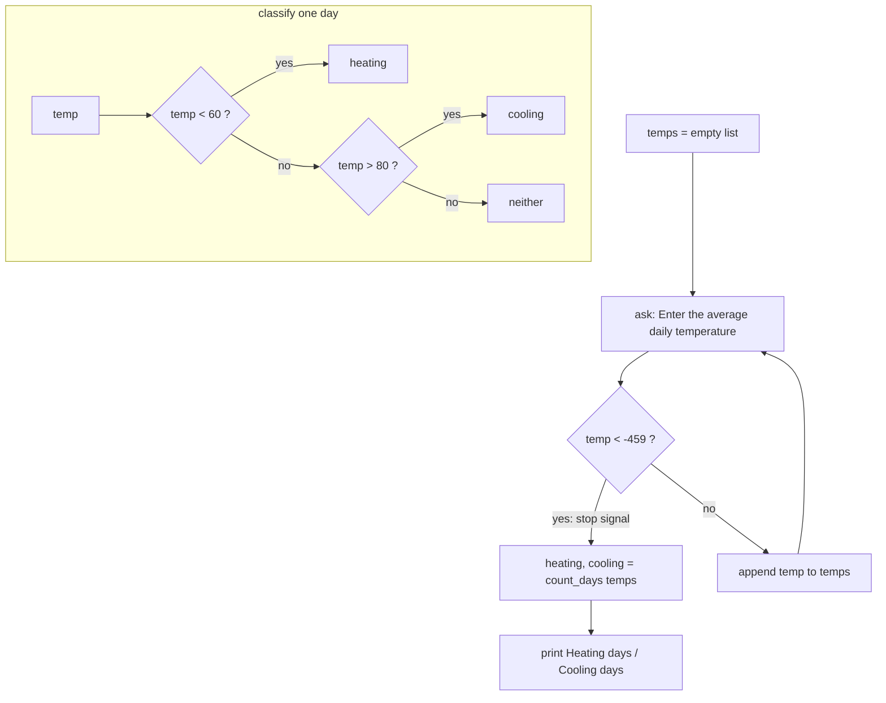
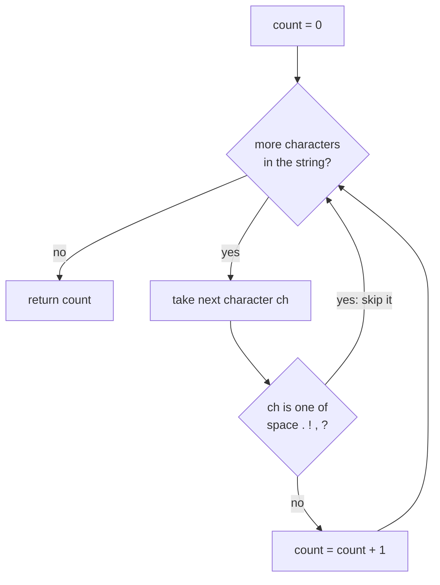
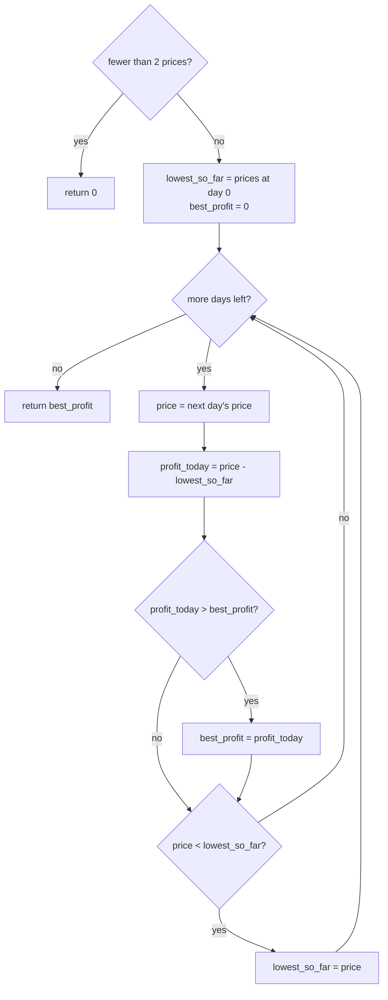
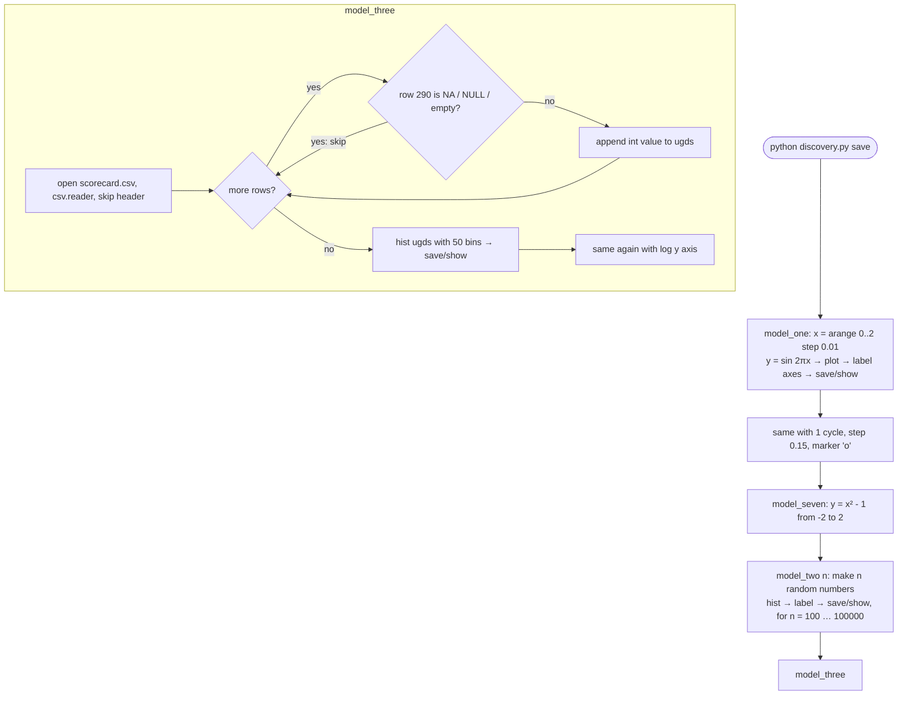

# Flowcharts for every program

One diagram per file. Diamonds are decisions, rectangles are actions.
Each Part 1 program has the same outer shape: run the tests if started with `test`, otherwise run `main()`.

## The shared outer structure (all Part 1 files)

```mermaid
flowchart TD
    A([python file.py ...]) --> B{started with<br>argument "test"?}
    B -- yes --> C[run_tests: every assert must hold]
    C --> D[print "all tests passed"]
    B -- no --> E[main: read input, call the function, print result]
```

## speedingticket.py — `ticket_amount(limit, speed)`



## heatingcooling.py — `main()` loop and `classify(temp)`



## countinput.py — `countchars(st)`



Example: `Listen, Mr. Jones, calm down.` has 29 characters; 4 spaces, 2 periods and 2 commas are skipped, leaving 21.

## stocktrading.py — `maxProfit(prices)`



Walk-through for `[7, 1, 5, 3, 6, 4]`:

| day | price | lowest so far | profit today | best so far |
|---|---|---|---|---|
| 0 | 7 | 7 | – | 0 |
| 1 | 1 | 1 | -6 | 0 |
| 2 | 5 | 1 | 4 | 4 |
| 3 | 3 | 1 | 2 | 4 |
| 4 | 6 | 1 | 5 | **5** |
| 5 | 4 | 1 | 3 | 5 |

## discovery.py — Part 2 program



## discovery_notebook.ipynb

Same steps as `discovery.py`, but each step is its own cell so the plot appears right under the code that made it.
